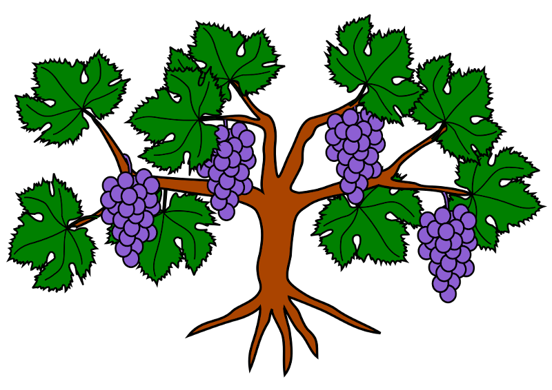

# GrapevineDB 

A simple object-oriented graph database in python. Easily find complex associations without the complex queries.

## Abstract

Finding indirect relationships is not an easy or typical usage for traditional databases. A graph database is designed in such a way that makes finding indirect associations for applications such as a social network or reccomendation engine much more efficient and easy. Below is a great photo from Nicolle Cysneiros Blog Post about Graph Databases on Medium to display the typical structure which I will be modeling:

Here are the problems I wish to solve with this project:

1. Quickly find specific types of associations in a set of data. With the way data is structured, this will be as simple as returning relations of a Node that match a specified label.
2. Find the level of association for indirect associations in order to make determinations or reccomendations. To find these associations quickly, a specialized depth-first will be used.
3. Categorize differing data by common associations. To find all the associations in the database, we can make use of a specialized breadth-first search.

### Resources

- https://en.wikipedia.org/wiki/Graph_database#/media/File:GraphDatabase_PropertyGraph.png
- https://medium.com/labcodes/graph-databases-talking-about-your-data-relationships-with-python-b438c689dc89

## Usage

A `sample_usage.py` file is provided as an example of how all of the methods on the database and subclasses work. Below are simplified explainations of important methods.

- `db = Database()` -> Creates a Database object.
- `db.add("users")` -> Adds users collection to the database. Returns a reference to the Collection.
- `db.insert({"name": "basketball"})` -> Insert an arbitrary node with the specified data into the database. Returns a reference to the Node.
- `db.remove("users", type="collection")` -> Remove _users_ collection from the database.
- `db.wipe()` -> Remove all collections and nodes from the database.
- `col.insert({"name": "basketball"})` -> Insert Node into collection with specified data. Returns a reference to the Node.
- `node.relate_to(other_node, by="FRIENDS_OF", bidirectional=True)` -> Relate _node_ to _other_node_ and _other_node_ to _node_ (if bidirectional is _True_) with the label _FRIENDS_OF_.
- `node.related_by("LIKES")` -> Return a list of nodes that are related to the node by label _LIKES_.
- `node.related_difference("FRIENDS_OF", "LIKES")` -> Return a list of nodes that are related to the node directly by label _FRIENDS_OF_ and indirectly by label _LIKES_.

## Future Todo

- Add visualize method to database that will render figure of a specific collection.
- Add a cli file that will serve as a command line interface/service for running the database and interacting with it.
- Improve file persistence to be incremental.
- Add REST API.
